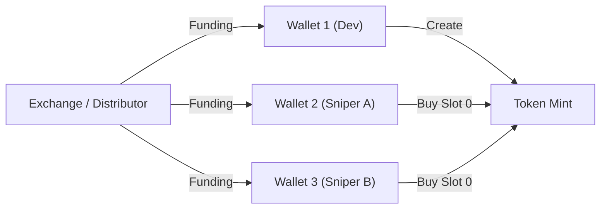

# Empirical Research & System Design Specification: Pump.fun Token Viability & Fraud Detection

## 1. Executive Summary & Problem Formulation

Pump.fun operates on a bonding curve Automated Market Maker (AMM) model where token creation is frictionless and initial liquidity is dynamically backed by the curve up to a graduation threshold (~85 SOL / ~$69,000 market cap). Upon reaching 100% of the bonding curve, liquidity is migrated to Raydium (or PumpSwap) with liquidity tokens burned.

Due to the absence of traditional smart contract "hard rugs" (minting functions, blacklists, or direct LP drains on the bonding curve), malicious actors instead utilize **algorithmic soft rugs**:
1. **Bundled Supply Cornering**: Packaging token creation and 10–20 max-buy orders into a single atomic block via Jito block builders.
2. **Sybil Wallet Splitting**: Funding multiple burner sniper wallets from a single central exchange (CEX) hot wallet or intermediary distributor to conceal insider ownership.
3. **Wash Trading Churn**: Generating artificial trade volume and velocity using automated micro-transactions to spoof platform "trending" algorithms.
4. **Post-Graduation Liquidity Extraction**: Holding 20–40% of the supply in fragmented wallets and dumping immediately as the bonding curve approaches 100% or upon Raydium migration.

Empirical studies indicate that **>98% of launched tokens are abandoned or dumped within hours**. The objective of this research system is to collect granular multi-modal data, execute graph-theoretic forensics, and train statistical survival models to identify the **~1.4% of organic, sustainable projects**.

---

## 2. Multi-Modal Data Architecture

```
                                  ┌───────────────────────────────┐
                                  │      wss://pumpdev.io/ws      │
                                  │ (Real-Time Trade/Mint Stream) │
                                  └───────────────┬───────────────┘
                                                  │
                                                  ▼
┌──────────────────────────────┐  ┌───────────────────────────────┐  ┌──────────────────────────────┐
│       Solana RPC Node        │  │     Data Ingestion Layer      │  │      IPFS / Arweave / Web    │
│ (Blocks, Traces, Jito Tips)  ├──▶  (SQLite / DuckDB / Timescale) ◀──┤  (Metadata, Images, Socials) │
└──────────────────────────────┘  └───────────────┬───────────────┘  └──────────────────────────────┘
                                                  │
                                                  ▼
                                  ┌───────────────────────────────┐
                                  │    Forensics & Model Engine   │
                                  │ (Graph, Microstructure, ML)   │
                                  └───────────────────────────────┘
```

### 2.1 Required Data Streams & Schemas

#### Stream A: Tick-by-Tick Market Data (via `pumpdev.io`)
* **Token Creation Event (`subscribeNewToken`)**:
  * `signature`, `mint`, `traderPublicKey` (creator), `initialBuy` (token units), `solAmount`, `bondingCurveKey`, `vTokensInBondingCurve`, `vSolInBondingCurve`, `marketCapSol`, `timestamp`.
* **Trade Tape (`subscribeTokenTrade`)**:
  * `signature`, `mint`, `traderPublicKey`, `txType` (`buy` | `sell`), `tokenAmount`, `solAmount`, `vTokensInBondingCurve`, `vSolInBondingCurve`, `slot`, `timestamp`.
* **Whale Monitor (`subscribeAccountTrade`)**:
  * High-frequency tracking across flagged cluster/cabal wallets.

#### Stream B: On-Chain Provenance (via Solana RPC)
* **Block-0 Data**:
  * `slot`, complete block transaction list via `getBlock(slot, {maxSupportedTransactionVersion: 0, transactionDetails: "full"})`.
  * Jito tip transfers (target addresses: `96gYZGLnJYVFmbjzopPSU6QiEV5fGqZNyN9nmNhvrZU5`, `DfXygSm4jCyNCybVYYK6DwvWqjKee8pbDmJGcLWNDXjh`, etc.).
* **Funding Ancestry Traces**:
  * Historical SOL funding transactions for top 20 early buyer wallets via `getSignaturesForAddress` and `getParsedTransaction` (depth: 2–3 hops).
  * Flagged source categories: CEX Hot Wallets, Mixers/Bridges (FixedFloat, ChangeNOW), Disperse/Multisig contracts.

#### Stream C: Off-Chain Metadata & Social Signals
* **Media Assets**: Token logo image, banner, metadata JSON (name, ticker, description) resolved via IPFS/Arweave gateway.
* **Social Endpoints**: Status and engagement of associated X/Twitter accounts, Telegram channels, and official domains.

---

## 3. Core Algorithms & Mathematical Formulations

### 3.1 Block-0 Bundle & Supply Cornering Detection
Let $B_0$ be the block (slot) containing the `create` instruction for token $M$.
Let $T(B_0, M)$ be the set of all transactions within $B_0$ interacting with mint $M$.

1. **Block-0 Bought Supply Ratio**:
   $$S_{B_0} = \frac{\sum_{t \in T(B_0, M)} \text{TokensBought}(t)}{\text{Total Supply}}$$
   * **Threshold**: If $S_{B_0} > 0.15$ (15% of supply acquired in slot 0), flag as **High-Risk Pre-bundled Sniping**.

2. **Jito MEV Tip Detection**:
   $$\text{IsBundled} = \exists t \in T(B_0, M) \quad \text{s.t.} \quad \text{Recipient}(t) \in \mathcal{K}_{\text{JitoTips}}$$

---

### 3.2 Graph-Theoretic Sybil Clustering
To identify hidden controller rings, construct a directed graph $G = (V, E)$:
* **Nodes $V$**: Solana wallet addresses.
* **Edges $E$**: SOL transfer transactions occurring within $T_{\text{lookback}} = 48\text{ hours}$ prior to mint creation.



#### Algorithms:
1. **Weakly Connected Components (WCC)**:
   Partition buyer wallets into connected components based on shared ancestors. If all top 5 buyers collapse into 1 component, the entity is singular.
2. **Cluster Share Ratio ($CSR$)**:
   $$CSR(C_k) = \frac{\sum_{w \in C_k} \text{Balance}(w, M)}{\text{Circulating Supply}}$$
   * **Rule**: If $\max_k CSR(C_k) > 0.20$, token is classified as **Insider Controlled Cabal**.

---

### 3.3 Concentration & Inequality Metrics

#### Herfindahl-Hirschman Index (HHI)
Quantifies holder monopolization across the top $N = 50$ circulating wallets:
$$\text{HHI} = \sum_{i=1}^{N} \left( \frac{\text{Balance}_i}{\text{Circulating Supply}} \times 100 \right)^2$$
* $\text{HHI} > 2,500$: Highly concentrated (monopoly/oligopoly).
* $\text{HHI} < 800$ with $N > 150$: Decentralized distribution.

#### Gini Coefficient
$$G = \frac{\sum_{i=1}^{n} \sum_{j=1}^{n} |x_i - x_j|}{2n^2 \bar{x}}$$
Measures wealth dispersion trajectory over time $t$. Organic tokens display a negative derivative $\frac{dG}{dt} < 0$ as supply disperses.

---

### 3.4 Microstructure & Order Flow Toxicity

#### Volume-Synchronized Probability of Toxicity (VPIN)
Partitions continuous trade tape into volume buckets of size $V$ ($V = \frac{\text{Daily Volume}}{50}$):
$$\text{VPIN} = \frac{\sum_{\tau=1}^N |V_\tau^B - V_\tau^S|}{N \times V}$$
* High VPIN ($\to 1.0$) denotes informed adverse selection: insiders systematically selling into incoming retail liquidity.

#### Trade Size Shannon Entropy (Wash Trading Filter)
Let $p(s_k)$ be the empirical probability distribution of trade sizes discretised into bins:
$$H(S) = -\sum_{k=1}^K p(s_k) \log_2 p(s_k)$$
* **Low Entropy ($H < 2.0$)**: Synthetic bot churn utilizing repeated uniform amounts (e.g., repeating 0.05 SOL or 0.1 SOL).
* **High Entropy ($H > 4.5$)**: Natural, irregular human trading.

---

### 3.5 Content & Meme Asset Forensics

#### Perceptual Hashing (pHash)
1. Convert token logo to 32x32 grayscale, compute Discrete Cosine Transform (DCT), extract low frequencies, generate 64-bit fingerprint hash $h(I)$.
2. Compare against database of historical tokens $\mathcal{D}$:
   $$\text{HammingDist}(h_1, h_2) = \sum_{b=0}^{63} (h_{1, b} \oplus h_{2, b})$$
   * **Rule**: $\text{HammingDist} \le 4 \implies$ **Image Clone / Reused Meme**.

---

## 4. Machine Learning & Survival Modeling

### 4.1 Target Variable Definition
Every token $i$ is labeled at $T = 72\text{ hours}$ post-launch:
* **Class 0 (Flash Rug / Abandoned)**: $\text{Peak SOL} < 10$, curve abandoned in $< 1\text{ hour}$, or dev sells $100\%$ within $15\text{ minutes}$.
* **Class 1 (Pump & Dump)**: Reaches 30–75 SOL bonding curve, followed by a $>85\%$ drawdown within $30\text{ minutes}$.
* **Class 2 (Organic / Sustained)**: Successfully graduates bonding curve (~85 SOL) and retains $>50\%$ of ATH liquidity on Raydium/PumpSwap for $\ge 48\text{ hours}$.

### 4.2 Modeling Approaches
1. **Cox Proportional Hazards Model (Survival Analysis)**:
   $$\lambda(t | X) = \lambda_0(t) \exp(\beta_1 X_1 + \beta_2 X_2 + \dots + \beta_p X_p)$$
   Models time-to-collapse, natively supporting right-censored tokens still trading.
2. **LightGBM Gradient Boosted Classifier + SHAP**:
   Classifies tokens at snapshot horizons ($t = 3\text{m}, 5\text{m}, 15\text{m}$) using engineered graph and microstructure features. SHAP values identify the exact non-linear thresholds of rug indicators.

---

## 5. Phased Development Roadmap

```
Phase 1: Ingestion & Storage ──▶ Phase 2: On-Chain Forensics & Graph
                                                │
                                                ▼
Phase 4: ML & Survival Models ◀── Phase 3: Microstructure & Content
         │
         ▼
Phase 5: Real-Time Research Engine & Dashboard
```

### Phase 1: Real-Time Data Ingestion & Storage Engine
* **Objective**: Establish resilient, lossless streaming of Pump.fun market events and persistent historical logging.
* **Deliverables**:
  1. Python asynchronous client for `wss://pumpdev.io/ws` with exponential backoff (1s–30s) and a 30s heartbeat watchdog.
  2. Persistent relational storage (DuckDB / SQLite / TimescaleDB) storing:
     - `tokens` table (mints, metadata, creator, bonding curve keys).
     - `trades` table (timestamp, signature, trader, direction, SOL, tokens, virtual reserves).
  3. Solana JSON-RPC connection layer with rate-limiting and fallback pools (Helius, QuickNode, Triton, or public RPCs).

### Phase 2: On-Chain Forensics & Wallet Graph Engine
* **Objective**: Build the verification modules that audit creation blocks and wallet provenance.
* **Deliverables**:
  1. **Block-0 Bundle Analyzer**: Inspects creation slot transactions, tallies total block-0 acquired supply, and flags Jito tip accounts.
  2. **Wallet Ancestry Extractor**: Crawls SOL transfer trees for early buyers up to 2 hops.
  3. **Graph Clustering Module**: NetworkX / igraph pipeline applying Weakly Connected Components (WCC) to group Sybil wallets and calculate Cluster Share Ratio ($CSR$).
  4. **Inequality Calculator**: Automated calculation of HHI and Gini coefficient across circulating holders.

### Phase 3: Market Microstructure & Content Forensics
* **Objective**: Implement real-time order tape analytics and asset originality verification.
* **Deliverables**:
  1. **VPIN & Order Flow Toxicity Calculator**: Rolling volume-bucket analyzer to detect insider liquidation into retail flows.
  2. **Trade Entropy & Wash-Trading Detector**: Rolling Shannon entropy and trade-sign autocorrelation engine.
  3. **Perceptual Image Hash (pHash) Vector Store**: Fast vector/Hamming search indexing token logos to identify cloned copycats.
  4. **Social Signal Auditor**: Asynchronous checker validating active status and metadata of attached Twitter/Telegram links.

### Phase 4: Statistical Modeling & Survival Analysis
* **Objective**: Train and evaluate predictive classification and survival models on historical token cohorts.
* **Deliverables**:
  1. **Dataset Generator**: Extract $t = 5\text{m}$ and $t = 15\text{m}$ feature vectors for $\ge 20,000$ historical tokens with assigned ground-truth labels.
  2. **Survival Analysis**: Fit Kaplan-Meier survival curves and Cox Proportional Hazards regression to calculate hazard ratios for each indicator.
  3. **Supervised ML Model**: Train a LightGBM multi-class model with cross-validation; evaluate Precision-Recall AUC and Brier Score.
  4. **SHAP Feature Importance**: Export global and local feature contribution plots.

### Phase 5: Production Research Dashboard & Real-Time Screener
* **Objective**: Package the research engine into an interactive live monitoring system.
* **Deliverables**:
  1. **Unified Event Bus**: Connects Phase 1 stream $\to$ Phase 2/3 forensics $\to$ Phase 4 scoring in under 500ms.
  2. **Interactive UI / Dashboard**: Streamlit or terminal-based dashboard displaying live token stream with safety scores, cluster graphs, and risk breakdowns.
  3. **Automated Research Exporter**: Tooling to export analyzed cohorts and statistical summaries for academic papers or research reports.

---

## 6. Repository Layout & Architecture

```
nemo/
├── README.md
├── docs/
│   └── PUMP_FUN_RESEARCH_AND_DEVELOPMENT_SPEC.md   <-- This Document
├── config/
│   └── settings.yaml                               <-- Endpoints, RPC URLs, thresholds
├── src/
│   ├── ingestion/
│   │   ├── pumpdev_client.py                       <-- wss://pumpdev.io/ws async client
│   │   ├── rpc_client.py                           <-- Solana RPC wrapper & rate limiter
│   │   └── storage.py                              <-- DuckDB/SQLite schema & queries
│   ├── forensics/
│   │   ├── bundle_detector.py                      <-- Block-0 and Jito tip checker
│   │   ├── wallet_graph.py                         <-- DAG ancestry & Sybil clustering
│   │   └── concentration.py                        <-- HHI and Gini computation
│   ├── microstructure/
│   │   ├── vpin.py                                 <-- Volume-synchronized toxicity
│   │   ├── entropy.py                              <-- Wash trading & entropy filters
│   │   └── phash_matcher.py                        <-- Perceptual image hashing
│   ├── models/
│   │   ├── dataset_builder.py                      <-- Feature vector extraction
│   │   ├── survival_model.py                       <-- Cox Proportional Hazards
│   │   └── classifier.py                           <-- LightGBM & SHAP explainability
│   └── dashboard/
│       └── app.py                                  <-- Streamlit / Terminal HUD
└── tests/
    ├── test_bundle_detector.py
    └── test_wallet_graph.py
```
